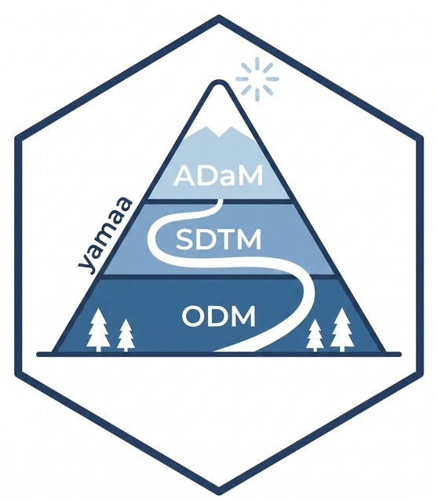
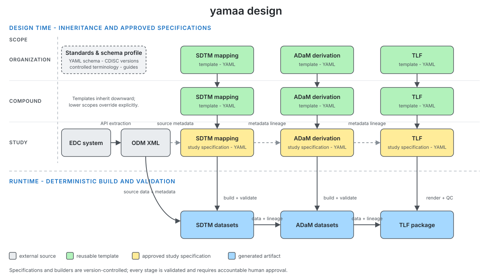

# yamaa 

YAMAA is a language-neutral YAML specification for reproducible clinical trial data pipelines that transform ODM data into SDTM, ADaM datasets following CDISC standards.

YAMAA is designed for AI-first workflows while keeping derivations reviewable, version-controlled, and consistent across implementations.

## Design



Reusable templates flow from the organization level through the compound and study levels. Approved study specifications then drive deterministic, validated builds while preserving metadata lineage.

## Repository

- [`yaml/`](yaml/) - schemas, execution rules, and examples
- [`R/`](R/) - R implementation and workflows, including [`R/cdiscbuilder/`](R/cdiscbuilder/)
- [`python/`](python/) - Python implementation
- [`docs/`](docs/) - diagrams and assets

## Example

The specification is deterministic by design and supports SQL expressions. More realistic examples are available in the [`yaml/examples/`](yaml/examples/) directory.

```yaml
- name: BMI
  type: float
  label: Body Mass Index (kg/m2)
  derivation:
    compute:
      expr: "WEIGHTKG / POWER(NULLIF(HEIGHTCM, 0) / 100, 2)"
```
