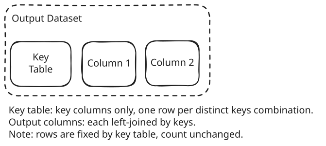

# KRC: key, row, column - the yamaa derivation model

> **YAMAA docs:** [Principles](principles.md) | [Why](why-yamaa.md) | [Excel to YAMAA](excel-to-yamaa.md) | [Derive](derive.md) | [Schema concepts](schema-concepts.md) | [Benchmark walkthrough](yaml-benchmark-walkthrough.md)

> **Read this if** you want the engine half of
> `data_output = derive(data_input, spec)`: what fixes the rows, what appends
> the columns, and where keys fit.

---

The contract from Principles is one execution: `data_output = derive(data_input, spec)`.
R001 splits that execution into two phases:

1. **Row construction** builds the output rows and may change the row count.
2. **Column derivation** enriches those rows and must not change the row count.

So there are only three things to keep straight: **key** says what a row is,
**row** says which rows exist, **column** says what each row carries.

## 1. Key - what a row is

`keys` states the output row identity and must be declared (R001-12). Every
row built later must still satisfy those keys; a repeated key combination
fails at the output gate.

The simple case - a specification without `rows` - makes this visible:

Read the diagram left to right:

- **Key Table**: key columns only, one row per distinct key combination, in
  first-appearance order over the input records. It is standalone: the input
  records a key combination was derived from decide its column values, never
  how many rows the artifact carries (R001-12).
- **Column 1, Column 2**: each output column attached by keys, like a
  left join against the Key Table. Deriving a column never adds or removes a
  row.

That is the note under the figure: rows are fixed by the key table, count
unchanged.

## 2. Row - which rows exist

When `rows` is present, each `rows` entry - each **row template** - is one
**section**. Sections build their rows separately and concatenate in
specification order (R001-12a). The full diagram adds this row axis on the
left:

Read the diagram top to bottom, then left to right:

- **Section 1, Section 2**: each row template keeps input records (record-driven)
  or input groups (group-driven) through its `filter`, and yields one row per
  kept record or group. The two blocks stack vertically because sections
  concatenate in specification order.
- **Keys still hold**: every built row must match the declared `keys`. A
  `filter` states which rows the artifact carries, never which input record
  represents a key combination. If the specification needs one row per key
  combination with no per-section logic, it omits `rows` and falls back to
  the key table in Figure 1.
- **A section is also a window partition**: window-speak for the same row
  group. Ordering inside the group is what row-relative derivation
  (`row_number`, `row_value`, `previous_non_missing`, baselines) runs over.

That is the note under the figure: rows fixed by sections, count unchanged.

## 3. Column - what each row carries

Each column is one pass over the frozen rows, in declaration order
(R001-28). For each row the derivation reads its input records and must
reduce to exactly one scalar: two present values for one key combination is
an error under R001-44 ("where it would have two, YAMAA fails instead of
choosing"), unless a handler such as `multiple_matches` keeps one. Missing
results are still the row's one value but never create a second value.
Dependencies form a DAG over columns: every dependency must refer to a
column declared earlier, and cycles fail.

The two figures show the two column shapes:

- **Figure 1 (simple)**: every column works the same way for all rows - match
  by key equality plus an optional predicate, reduce to one scalar. Two
  common reductions are **aggregate** (many-to-one: `SUM`, `COUNT`, `MIN`,
  `MAX`, `MEAN`, `ONLY`) and **window** (many-to-many within the section:
  prefix or positional reads of ordered sibling rows).
- **Figure 2 (full)**: one declaration, two behaviors. **Shared columns**
  (the tall Key Table and Column 1 blocks spanning both sections) derive at
  column level with the same logic for all rows. **Section columns** (the
  split Column 2 blocks, one per section) derive per section under one
  declaration, in every section. A missing policy (`missing`, `strict`, and
  the per-expression handlers) is a per-column annotation, not a row
  manipulation.

## In practice

A DM derivation without `rows`: key expressions over the input records yield
one row per `(STUDYID, USUBJID)` and freeze. Then one pass per column -
`SEX` matches each row's input records by key equality plus a predicate and
reduces to one scalar; `AGE` computes over already-materialized columns.

A BDS-style derivation with `rows`: Section 1 builds parameter rows from one
input dataset, Section 2 builds them from another; the sections concatenate
in specification order and must still satisfy the keys. A shared column such
as `USUBJID` derives once for all rows, while a section column such as `AVAL`
derives per section under one declaration. A window ordered by visit date
within each subject lets February's missing weight read January's
materialized weight.

## Vocabulary

The working terms of derive: key, row, column, key table, row template,
section, shared column, section column, partition, window, missing policy.

- **Key table**: the diagram label (and R001's term) for the key-columns-only
  row set used when `rows` is absent.
- **Row template**: one `rows` entry. **Section** is the same block seen as a
  row group; **partition** is window-speak for section.
- **Record** is input side, **row** is output side; **column** is dataset
  level, **variable** is expression level.
- **`function`** is the escape hatch for specialized reductions: Derive with
  an opaque body under a declared contract.

## Next

KRC is what the engine does. For what you write - the spec half of the
contract - read Schema concepts.
