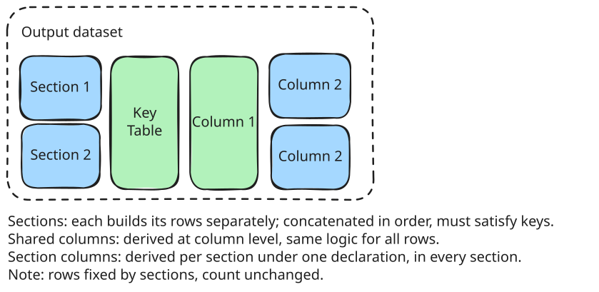

# Derivation: keys, rows, columns

## Summary

One specification produces one dataset:

> `output_dataset = derive(input_datasets, spec)`

yamaa first constructs the output rows and then derives columns onto those
rows. Column derivation never changes the row count.

| Spec field | Question | Answer |
|---|---|---|
| `keys:` | What identifies a row? | The ordered columns whose combined values must be present and unique. |
| `rows:` | Which rows exist? | When present, row templates construct rows from retained input records or groups. |
| `columns:` | What does each row carry? | Each derivation produces exactly one value per constructed row, in declaration order. |

When `rows` is absent, the distinct key combinations in the default input
construct the output rows. When `rows` is present, its templates construct the
rows and `keys` validate their identity.

## Keys identify rows

`keys:` is always required. It names output columns that together identify
one row:

```yaml
domain: ADSL
keys: [STUDYID, USUBJID]   # one row per subject
```

```yaml
domain: ADLB
keys: [STUDYID, USUBJID, PARAMCD, ADT, ASEQ]   # one row per analysis record
```

```yaml
domain: ADAE
keys: [STUDYID, USUBJID, AESEQ]   # one row per event
```

Every completed row must have non-missing key values, and no two rows may
have the same key combination.

## Without `rows`: distinct keys construct the rows

Omit `rows` when the desired output has one row per distinct key combination
already represented by the input. The input need not be physically
one-to-one: several input records may contribute values to the same output
row.

```yaml
domain: ADSL
input:
  DM: source/dm.csv
keys: [STUDYID, USUBJID]
columns:
  - name: STUDYID
    type: str
    label: Study Identifier
    derivation: DM.STUDYID
  - name: USUBJID
    type: str
    label: Unique Subject Identifier
    derivation: DM.USUBJID
  - name: AGE
    type: int
    label: Age
    derivation: DM.AGE
```


Read the diagram from left to right. The **Key Table** contains each distinct
key combination once, in first-appearance order. **Column 1** and **Column 2**
attach values to those fixed rows.

Each column derivation must resolve to exactly one value for a row. Repeated
copies of the same present value still count as one value; competing present
values fail instead of forcing yamaa to choose. A missing result remains the
row's single missing value.

## With `rows`: templates construct sections

Use `rows` when the specification must explicitly construct different kinds
of output rows. Each entry is a **row template** and builds one **section**.
Sections concatenate in specification order.



This partial fragment builds separate HEIGHT and WEIGHT sections from one
input dataset:

```yaml
input: {VS: source/vs.csv}

rows:
  - id: height
    filter: "VS.PARAMCD = 'HEIGHT'"
    derivations:
      PARAMCD: {literal: HEIGHT}
      AVAL: VS.AVAL

  - id: weight
    filter: "VS.PARAMCD = 'WEIGHT'"
    derivations:
      PARAMCD: {literal: WEIGHT}
      AVAL: VS.AVAL
```

The constructed rows must still satisfy `keys`: every key value must be
present and every key combination unique. Section order is construction
order; an optional `output.order_by` may independently reorder the finished
artifact.

## Columns fill the constructed rows

Columns resolve in declaration order, so a later column may read an earlier
one. A column may be derived in exactly one of two places:

- At column level, using the same derivation for every constructed row.
- At row level, using `derivations` in every row template so each section can
  supply different logic.

A column cannot mix the two placements. A row-derived column must appear in
every row template; use `{literal: null}` when its value is deliberately
missing in one section.

## More examples

- Derive age groups in ADSL:
  [adam-adsl-age-group](https://elong0527.github.io/yamaa/benchmark/adam-adsl-age-group.html).
- Derive BMI in ADVS:
  [adam-advs-bmi](https://elong0527.github.io/yamaa/benchmark/adam-advs-bmi.html).
