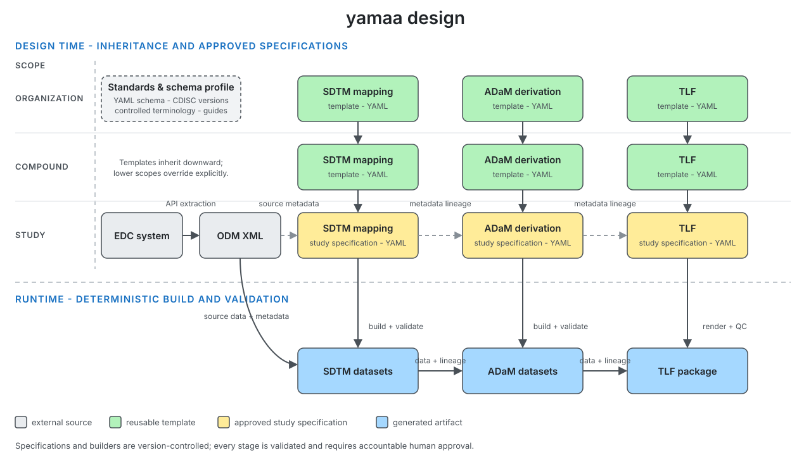

## Disclaimer

The views and opinions expressed in this presentation are those of the
individual presenter. They do not represent those of their affiliated
organizations or institutions.


## Contributors {.center}

::: {.center-body-left}
- **Peng Zhang** CIMS Global
- **Bingjun Wang** Genentech
- **Ming-chun Chen** Summit Therapeutics
- **Yilong Zhang** BBSW AI Committee
:::

## Motivation

* Two AI agents use the same specification to derive ADaM data.
* Both report completion, but their source code and outputs differ.
* A reviewer makes non-trivial efforts to resolve the difference before signing off.

From an FDA [warning letter](https://www.fda.gov/inspections-compliance-enforcement-and-criminal-investigations/warning-letters/purolea-cosmetics-lab-722591-04022026).

> "you must review the AI-generated documents to ensure they were accurate and actually compliant..."

## One root cause

* The user prompt leaves business rules implicit, so agents must infer them.
* Business rules can differ from language defaults, e.g.:
  * [R](https://stat.ethz.ch/R-manual/R-devel/library/base/html/Round.html) and [Python](https://docs.python.org/3/library/functions.html#round) round ties to even.
  * [SAS](https://documentation.sas.com/api/docsets/lrcon/9.4/content/lrcon.pdf) compares missing numeric values as lower than non-missing values.

## Goal

- Reduce human review effort.
- Leverage organization templates.
- Capture business rules that AI agents can apply.
- Human and AI agents align at the planning stage.

## yamaa: YAML specification example

```yaml
schema_version: "1.0"
domain: ADSL
keys: [STUDYID, USUBJID]
input:
  SOURCE: input/adsl.csv

columns:
  - name: BMI
    type: float
    label: Body Mass Index (kg/m2)
    derivation:
      compute:
        expr: "WEIGHTKG / POWER(NULLIF(HEIGHTCM, 0) / 100, 2)"

verifications:
  - unique:
      columns: [STUDYID, USUBJID]
```

## yamaa: benchmarks

::: {.columns}
::: {.column width="48%"}
<div class="big-number">~ 300</div>
<div class="metric-label">runnable benchmarks</div>
:::

::: {.column width="48%"}
<div class="big-number">2</div>
<div class="metric-label">engines (Python, R)</div>
:::
:::

* [Explore all benchmarks](https://elong0527.github.io/yamaa/benchmark/)

<iframe class="benchmark-embed" src="https://elong0527.github.io/yamaa/benchmark/adam-adsl-age-group.html" title="Age Groups benchmark dashboard"></iframe>

Scroll inside the frame to explore the spec, inputs, and golden output.

## yamaa: full studies

* Build publicly available ground truth.
  * [https://github.com/RConsortium/submissions-pilot7-synthetic-data](https://github.com/RConsortium/submissions-pilot7-synthetic-data)
* CDISC pilots (SDTM -> ADaM)
  * cdiscpilot01 and RConsortium submission pilots 3, 5, and 6
* OpenClinica real sample data (ODM -> SDTM -> ADaM)
  * Real sample data for testing the full data journey
* Synthetic studies (ODM -> SDTM -> ADaM)
  * KN564 and KN189 as scalable test beds

## yamaa: core principle

> A yamaa specification has exactly one execution. Where it would have two,
> yamaa fails instead of choosing.

::: {.formula}
*`output_dataset = derive(input_datasets, spec)`*
:::

The design of yamaa is a contract between people and AI agents.

- **spec**: schema following closed vocabulary.
- **derive**: business rules with derivation semantics.

## yamaa: inheritance



Inheritance reduces duplication while keeping every resolved study specification self-contained and reviewable.
([example](https://elong0527.github.io/yamaa/benchmark/schema-inheritance.html))

## yamaa: four components

| Component | Purpose | Links |
| --- | --- | --- |
| Schema | Declares the vocabulary of the specification. | [Repository](https://github.com/elong0527/yamaa/tree/main/yaml) / [Introduction](https://elong0527.github.io/yamaa/articles/schema-intro/) |
| Rules | Defines the meaning of each specification. | [Repository](https://github.com/elong0527/yamaa/tree/main/rules) / [Rules](https://elong0527.github.io/yamaa/articles/rules/) |
| Engine | Runs specifications in Python and R according to the rules. | [Python](https://github.com/elong0527/yamaa/tree/main/python) / [R](https://github.com/elong0527/yamaa/tree/main/R/cdiscbuilder) |
| Benchmark | Provides runnable specification examples. | [Repository](https://github.com/elong0527/yamaa/tree/main/benchmarks) / [Dashboards](https://elong0527.github.io/yamaa/benchmark/) |


## Recommendations: ODM XML

- [CDISC ODM](https://www.cdisc.org/standards/data-exchange/odm) is an XML standard for clinical research data.
- EDC systems can export study data in ODM XML.
- Teams familiar with define.xml will recognize the ODM structure.

Learn with AI: [https://arena.ai/](https://arena.ai/)

## Recommendations: Input and Output

- Plain text is the input.
- Annotated CRF is not an input but an output.
- Excel specification is not an input but an output.
- Communication costs more than tokens.

## How to contribute

* RConsortium / BBSW
  - [Submission working group Pilot7](https://rconsortium.github.io/submissions-wg/pilot7.html)
  - [Slack channel / Regular Meetings](https://rconsortium.github.io/submissions-wg/join.html)

* Public benchmarks
  - **Review a benchmark**: inspect the specification and golden output
  - **Add comments**: question assumptions, clarity, and conformance
  - **File issues**: record anything ambiguous or incorrect
  - **Open pull requests**: contribute fixes and new benchmarks

## Benchmark to deployment

- **Benchmarks** help assess an AI agent before adoption.
- **Deployment** also requires onboarding the agent to a specific organization environment.

Collaborating with [keiji.ai](https://keiji.ai/) to test synthetic clinical trial data.

[https://github.com/RConsortium/submissions-pilot7-synthetic-data](https://github.com/RConsortium/submissions-pilot7-synthetic-data)

## Reference

- **Repository:** [github.com/elong0527/yamaa](https://github.com/elong0527/yamaa)
- **Documentation:** [elong0527.github.io/yamaa](https://elong0527.github.io/yamaa/)
- **Benchmarks:** [elong0527.github.io/yamaa/benchmark](https://elong0527.github.io/yamaa/benchmark/)
